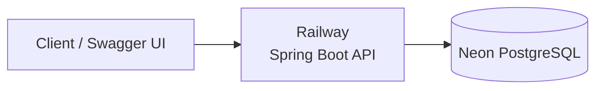
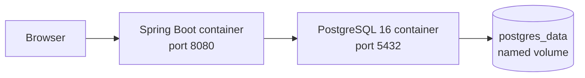
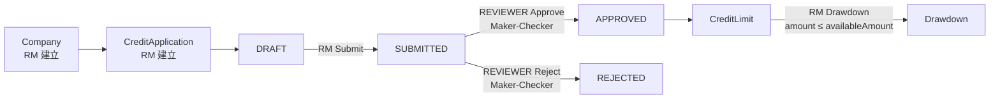
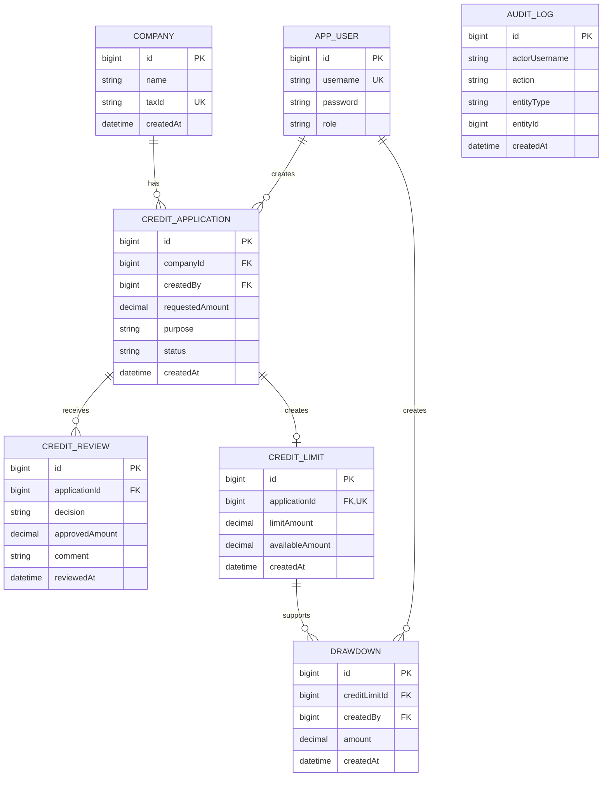

# Corporate Credit Management System

以 **Java 21／Spring Boot** 建置的金融後端作品，模擬企業授信從建檔、申請、獨立審核、額度建立到動用的完整流程，重點展示 **Business Rule、Transaction、Security 與 Testing**。

## 30 秒快速總覽

| 項目 | 內容 |
| --- | --- |
| Tech Stack | Java 21、Spring Boot 3.5.16、Spring Data JPA、Spring Security、PostgreSQL、Flyway、JWT、OpenAPI |
| 核心流程 | Company → CreditApplication → Submit → Approve／Reject → CreditLimit → Drawdown |
| Production | Railway Spring Boot API + Neon PostgreSQL |
| Production API Base URL | [https://minghan-credit-api.up.railway.app](https://minghan-credit-api.up.railway.app) |
| Swagger UI | [https://minghan-credit-api.up.railway.app/swagger-ui/index.html](https://minghan-credit-api.up.railway.app/swagger-ui/index.html) |
| Health API | [https://minghan-credit-api.up.railway.app/api/health](https://minghan-credit-api.up.railway.app/api/health) |
| CI／Tests | 67 tests；JUnit 5、Mockito、Spring Security Test、GitHub Actions |
| Docker | Multi-stage image + PostgreSQL 16 Compose environment；已完成本機驗證 |

Production secrets、Neon connection 與 demo account passwords 由 Railway Variables 管理，不存放於 Repository。展示帳號角色為 `demo_rm`／RM 與 `demo_reviewer`／REVIEWER；密碼不公開於 Git。

## 系統架構

### Production



### Local Docker



Docker 用於本機 packaging 與可重現環境；目前 production deployment 仍是 **Railway + Neon PostgreSQL**。

## 核心業務流程



## ERD



`AuditLog` 保存 actor username 與操作目標 snapshot，目前沒有對 `AppUser` 或業務 Entity 建立 Foreign Key。

## 核心 Business Rules

- 狀態只允許 `DRAFT → SUBMITTED → APPROVED／REJECTED`。
- Maker-Checker 在 Service 層禁止申請建立者審核自己的案件。
- Approve 時 `approvedAmount > 0` 且不得超過 `requestedAmount`。
- Approve transaction 同時更新 Application、建立 CreditReview 與唯一 CreditLimit。
- Reject 建立 CreditReview，但不建立 CreditLimit。
- Drawdown 以 `PESSIMISTIC_WRITE` 鎖定 CreditLimit，避免並行超額動用。
- Drawdown 超過 `availableAmount` 回傳 `409 Conflict`，且不得扣減額度或留下部分資料。
- AuditLog 加入既有 business transaction；business action 或 audit write 失敗時同步 rollback。

## Security

- JWT authentication，Spring Security 採 Stateless Session。
- RBAC 區分 RM 與 REVIEWER：RM 建立／Submit／Drawdown，REVIEWER Approve／Reject。
- Maker-Checker 是獨立的 Service business rule，不只依賴 endpoint role authorization。
- 未登入與權限不足分別使用 `401 Unauthorized`／`403 Forbidden`，並回傳一致的 JSON error contract。
- 密碼使用 BCrypt；JWT secret 與 production credentials 全部外部化。

## Testing／CI

- **67 automated tests**，目前為 0 failures／0 errors／0 skipped。
- 使用 JUnit 5、Mockito 與 Spring Security Test 驗證 Business Rules、Transaction Boundary、RBAC、Maker-Checker 與錯誤回應。
- GitHub Actions 在 push／pull request 執行 Maven `test` 與 `package`。
- Railway 已連接 GitHub `main`，push 後會自動 build 並部署 production，形成 GitHub Actions CI + Railway CD 流程。
- 已以 REST Client 與 PostgreSQL 人工驗證完整授信流程、Audit Trail、額度扣減與失敗 rollback。
- Railway／Neon production 已驗證 Health、Swagger、JWT Login、RBAC、Maker-Checker、Approve／CreditLimit 與 Drawdown。
- 已知測試限制：尚未導入 Testcontainers 與真實 Database Integration Tests。

## Docker

```bash
docker compose up --build
```

啟動後：

- Swagger UI：[http://localhost:8080/swagger-ui/index.html](http://localhost:8080/swagger-ui/index.html)
- Health API：[http://localhost:8080/api/health](http://localhost:8080/api/health)

Docker environment 包含：

- Multi-stage `Dockerfile`：Maven 3.9.11／Eclipse Temurin 21 build，Eclipse Temurin 21 JRE runtime。
- PostgreSQL 16 container 與 database healthcheck。
- App 透過 `depends_on: condition: service_healthy` 等待 database ready。
- `postgres_data` named volume 保留 database data。
- `.dockerignore` 排除 build output、Git／IDE metadata、logs 與 `.env`。

已驗證 image build、Compose config／up／down、Health、Swagger、volume 保留、container restart 與 cached rebuild。這是本機 packaging／execution environment；**production 仍部署於 Railway，database 仍使用 Neon PostgreSQL**。

## Demo Flow

1. 使用 RM 或 REVIEWER 帳號呼叫 `POST /api/auth/login` 取得 JWT。
2. 建立 Company（V1 Company API 目前為 public）。
3. RM 建立 `DRAFT` CreditApplication。
4. RM Submit，案件進入 `SUBMITTED`。
5. REVIEWER Approve 或 Reject；Maker-Checker 阻擋審核自己的案件。
6. Approve 後自動建立 CreditLimit；Reject 不建立額度。
7. RM 在可用額度內建立 Drawdown，系統同步扣減 `availableAmount`。
8. Create／Submit／Approve／Reject／Drawdown 操作寫入 AuditLog。

## Known Limitations

- Company API 尚未正式套用 RBAC。
- AuditLog read API 尚未實作。
- Testcontainers／Database Integration Tests 尚未實作。
- 無前端 UI；Swagger UI 是主要 Demo 操作介面。

## Documentation

完整工程計畫、Stage 歷史與驗證紀錄請參考 [PROJECT_PLAN.md](PROJECT_PLAN.md)。
